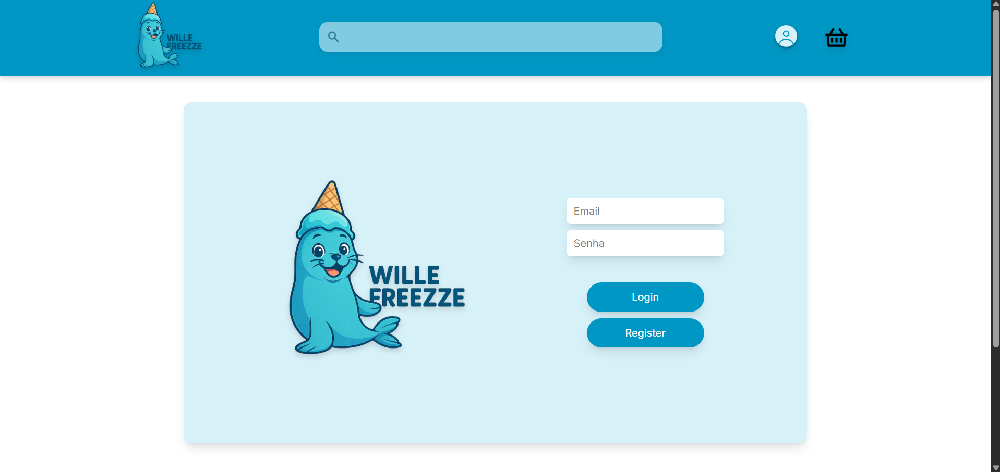
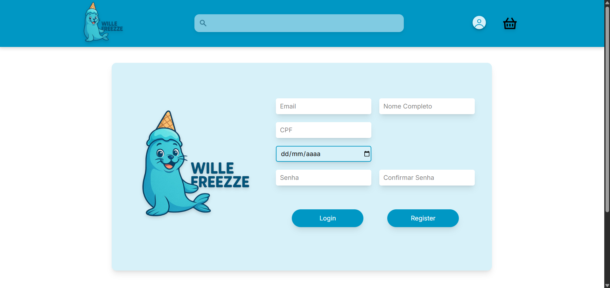
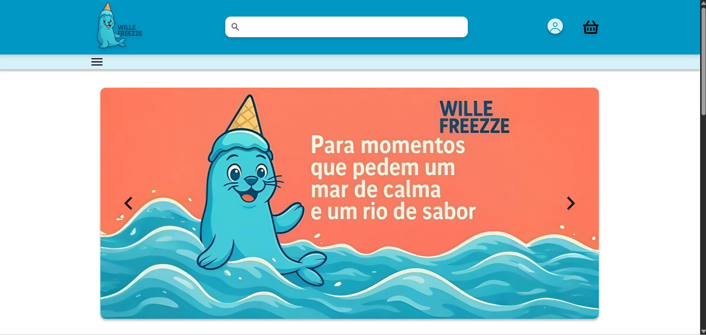
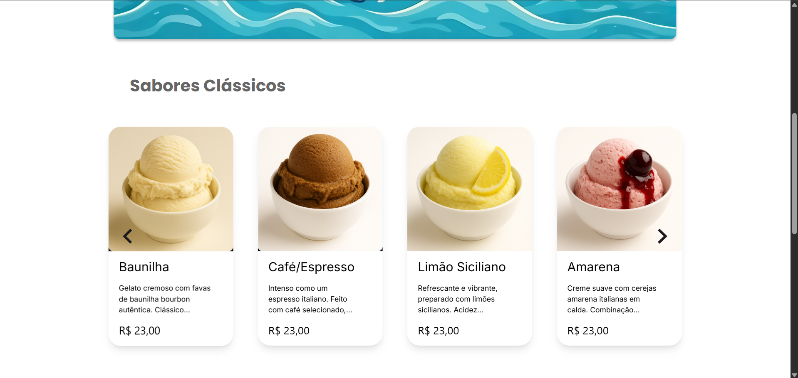
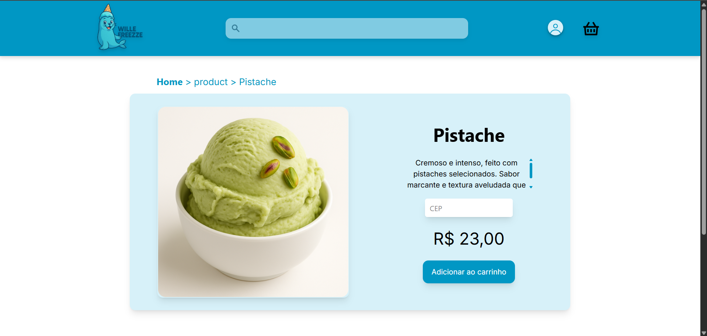
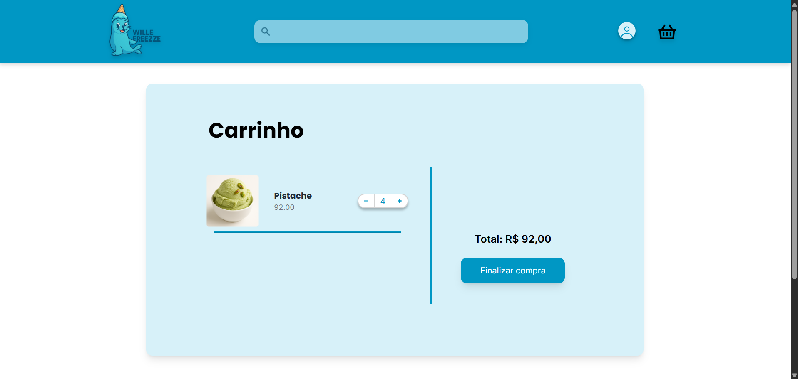
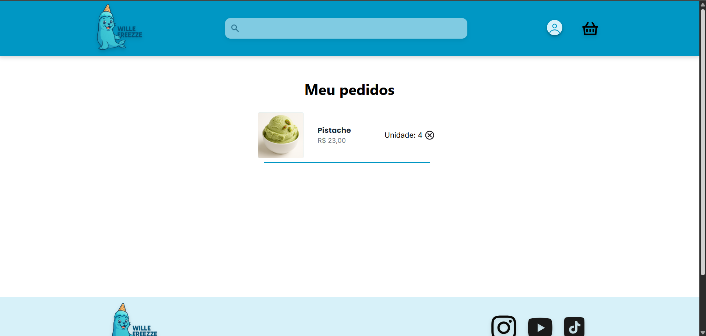
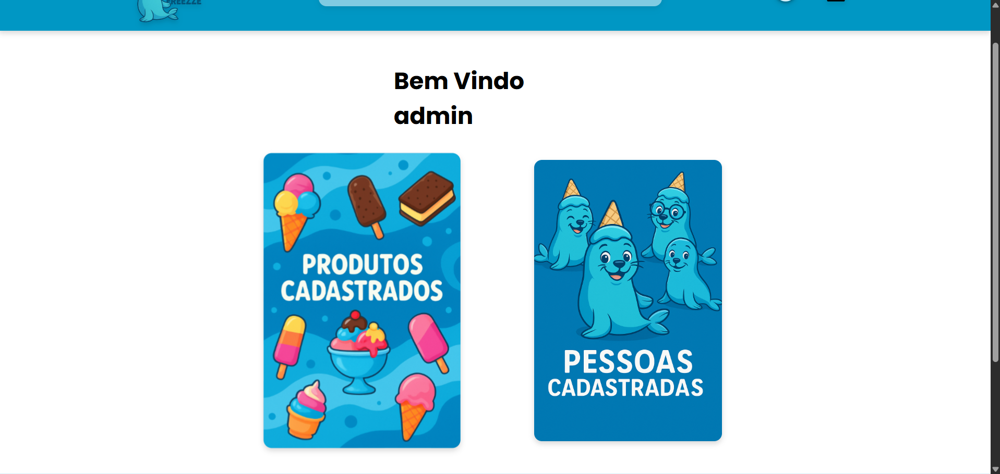
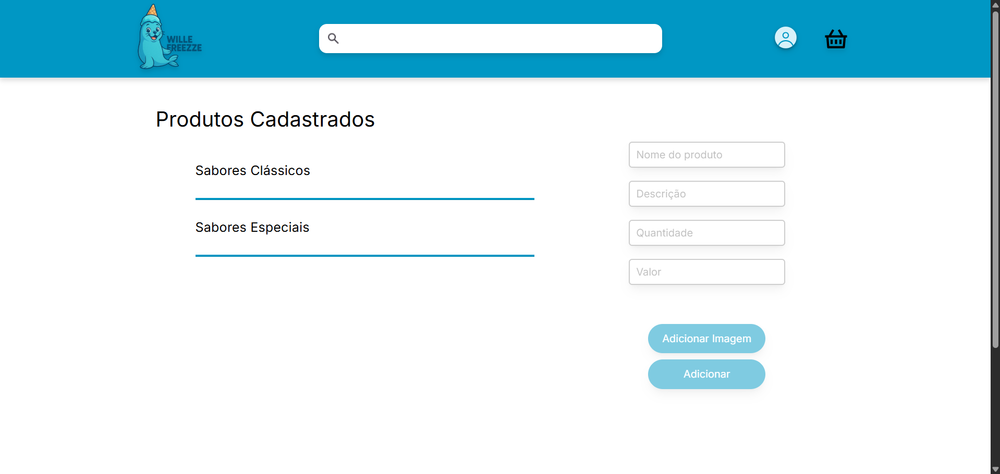
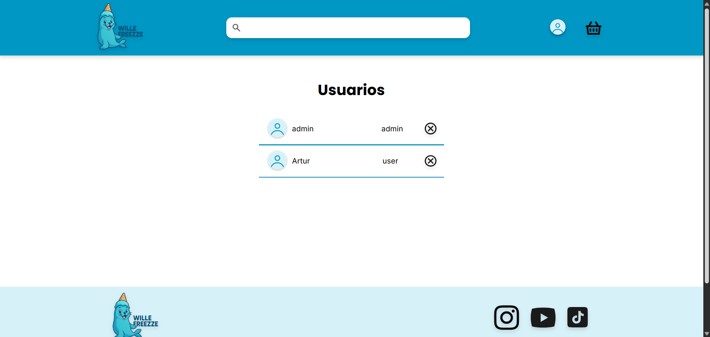

 

   
  

Wille Freeze é uma aplicação desenvolvida para representar de forma prática e interativa o funcionamento de uma loja de gelatos artesanais. Seu principal objetivo é oferecer uma experiência que simula todo o processo de compra — desde a escolha dos sabores até a gestão completa do catálogo, permitindo a interação tanto de clientes quanto de administradores.

Dentro do sistema, o usuário pode navegar entre os diferentes sabores disponíveis, visualizar descrições detalhadas e selecionar a quantidade desejada antes de concluir sua compra. Todo o processo foi pensado para transmitir a sensação de uma vitrine digital elegante, intuitiva e funcional, onde cada detalhe reflete o cuidado da marca com o produto.

Já o administrador possui acesso a um painel de controle exclusivo, que permite adicionar, editar e remover produtos de forma dinâmica. Além disso, é possível gerenciar usuários, excluindo contas ou definindo quais terão permissões administrativas — garantindo total controle sobre o ambiente da loja.

Essa estrutura faz da Wille Freeze uma aplicação completa, que une usabilidade e gestão em um mesmo espaço digital. A experiência foi projetada para ser fluida e responsiva, atendendo tanto quem deseja explorar os gelatos disponíveis quanto quem precisa administrar o negócio de forma prática e organizada.

Embora o foco da aplicação esteja na simulação do funcionamento de uma loja virtual — sem transações reais ou integração com backend —, sua estrutura reflete conceitos importantes de organização, escalabilidade e gerenciamento de dados locais, oferecendo uma base sólida para estudos e demonstrações de boas práticas no desenvolvimento front-end.

## 🎯 Propósito

Este projeto foi desenvolvido como parte do programa de Pós-Graduação em Desenvolvimento Full Stack da PUC-Rio, com o objetivo de colocar em prática os conceitos teóricos estudados ao longo do curso.

Durante o desenvolvimento, foi possível aprimorar habilidades relacionadas às arquiteturas de software, compreender de forma mais profunda o processo de implantação de containers utilizando o Docker e aperfeiçoar o uso do React na criação de interfaces dinâmicas, escaláveis e responsivas.

A aplicação desenvolvida — Wille Freeze — representa o funcionamento de uma loja de gelatos artesanais, permitindo a interação entre usuários e administradores em um ambiente totalmente simulado no navegador. Por meio dessa experiência, foi possível reforçar conhecimentos sobre organização de componentes, gerenciamento de estados e boas práticas de desenvolvimento front-end, consolidando uma base sólida para projetos futuros.

## 🖥️ Interface
### 🔑 Login



### 🏠 Principal



### 🍦 Produto


### 🛒 Carrinho


### 💳 Compras


### 🧑‍💼 Principal Admin


### 🧰 Controle de Produtos


### 👥 Controle de Usuarios



## 🔗 APIs
Para o funcionamento da aplicação, são utilizados os seguintes serviços:

- **[BrasilApi](https://brasilapi.com.br/)** → responsável pela autenticação e validação do CEP. 


## 🚀 Tecnologias

- **React JS** (construído com Vite)
- **Redux Tool Kit**
- **Docker** (Container)  
- **Tailwind CSS**  
- **JavaScript**  
- **Google Fonts**  
- **Swiper** (sliders e carrossel)
- **mui/material** (design)
- **React Routes** 
- **React Responsive**

## 🛠️ Como utilizar 

### 2️⃣Clone o repositório:
```bash
git clone https://github.com/ArturRabello/WilleFreezze-.git
```

### 4️⃣ Executar localmente com NPM

**Instalar as dependencias**
```bash
npm install
```
**Inicie o servidor de desenvolvimento:**
```bash
npm run dev
```

### 5️⃣ Execute em um container Docker
**Será necessario que você tenha o Docker Desktop instalado em sua maquina.**
- [Windows](https://docs.docker.com/desktop/setup/install/windows-install/)
- [Linux](https://docs.docker.com/desktop/setup/install/linux/)
- [Mac](https://docs.docker.com/desktop/setup/install/mac-install/)

**Caso seu sistema operacional seja Windows ou Mac, será necessário instalar o [WSL 2](https://learn.microsoft.com/pt-br/windows/wsl/install)**

#### DockerFile
**Antes de explicarmos o Dockerfile, é importante mencionar que utilizaremos o Nginx para servir a aplicação React em produção.**

O Nginx atua como um servidor web leve e rápido, responsável por entregar os arquivos estáticos gerados pelo build do React, garantindo que a aplicação seja acessível via navegador de forma eficiente e segura. [Saiba mais](https://nginx.org/en/docs/)


**Eu recomendo utilizar esse dockerfile.**
- **Fase de build (builder)**
    - Usa a imagem **Node 20 (alpine)** → leve e otimizada.

    - Define **/app** como diretório de trabalho.

    - Copia os arquivos **package.json** e instala as dependências **(npm ci)**.

    - Copia o restante do código e roda **npm run build** → gera a versão otimizada do React (pasta /build).
- **Fase de produção**
    -  Usa a imagem **Nginx (alpine)** → para servir os arquivos estáticos.
    -  remove o default do nginx **/etc/nginx/conf.d/default.conf**
    -  copia o seu arquivo de config customizada para dentro do container **/etc/nginx/conf.d/default.conf**
    -  Copia os arquivos gerados no build **(/app/build)** para a pasta do **Nginx** (/usr/share/nginx/html).
    -  Copia a configuração customizada do **Nginx (nginx.conf)**.
    - Expõe a **porta 80**.
    - Sobe o **Nginx em primeiro plano** para rodar a aplicação.
```
RUN npm run build 

FROM nginx:alpine

RUN rm /etc/nginx/conf.d/default.conf

COPY nginx.conf /etc/nginx/conf.d/default.conf

COPY --from=build /app/dist /usr/share/nginx/html

EXPOSE 80

CMD ["nginx", "-g", "daemon off;"]
```

#### Nginx.conf

Esse arquivo configura o Nginx para servir a aplicação React de forma eficiente, garantindo que arquivos estáticos sejam entregues corretamente e que todas as rotas da SPA funcionem mesmo ao recarregar a página.


```
server {
    listen 80;
    server_name localhost;
    
    location / {
        root /usr/share/nginx/html;
        index index.html index.htm;
        try_files $uri $uri/ /index.html;
    }
}
```

#### Docker Compose

O serviço frontend usa o Dockerfile local para construir a imagem da aplicação React, serve a aplicação via Nginx e expõe a porta 3000 no host para acesso pelo navegador.

 - **Service** → Define os serviços que o Docker Compose vai gerenciar.
 - **frontend** → Nome do serviço.
 - **build .** →  Indica que o Docker Compose vai usar o Dockerfile presente na pasta atual (.) para construir a imagem do frontend.
 - **container_name: WilleFreeze** → Nome do container.
 - **ports: 8080:80** → faz o mapeamento de portas (http://localhost:8000).

```
version: "3.9"
services:
  web:
    build: .
    container_name: WilleFreeze
    ports:
      - "8080:80"
    restart: always
```

#### Construir a imagem e subir o container

**Controi a imagem**
```
docker compose build
```

**Cria containers (se não existirem) e sobe eles. Pode rebuildar imagens se necessário.**

```
docker compose up
```

**Inicia o container**
```
docker compose start
```

## 🔍 funcionalidades
- **🔐 Login e registro simples:** O sistema realiza o processo de autenticação verificando no localStorage se o e-mail e a senha correspondem aos dados cadastrados. O formulário de registro inclui validações que asseguram o preenchimento completo e correto de todos os campos.
Essa funcionalidade tem caráter apenas demonstrativo, sem implementação de autenticação segura ou uso de tokens.

- **🔗 Integração com a API Brasil CEP:** Antes de adicionar um produto ao carrinho, o sistema realiza uma verificação do CEP informado por meio da API Brasil CEP, garantindo que o endereço inserido seja válido e formatado corretamente.

- **📦 Limite de stoque por produto:** Caso a quantidade disponível no estoque de um produto seja zerada, ele não poderá ser adicionado ao carrinho, garantindo que compras acima da disponibilidade não ocorram.

- **🧮 selecionar a quantidade de produtos:** No carrinho, antes de finalizar a compra, o usuário pode definir a quantidade desejada de cada item por meio de um contador (count), permitindo ajustar o total de produtos a serem adquiridos

- **🎞️ Sliders interativos para a axibição dos produtos:** Os produtos são apresentados em cards dentro de carrosséis separados por tópicos ou categorias, permitindo a visualização organizada e interativa de diferentes grupos de itens.

- **👤 UserController**: O administrador tem acesso a funcionalidades de gestão de usuários, podendo excluir contas ou promover usuários comuns a administradores, facilitando a administração do sistema e o controle de permissões.

- **🛒 ProductController**: o administrador tem acesso a todas as funcionalidades de gestão de produtos, incluindo inclusão de novos itens, atualização de preços e estoque e exclusão de produtos, mantendo o catálogo sempre atualizado e organizado.

## 📂 Estrutra do projeto

```
📦 Keep-Cine
├── 📂 public/              # 📜 Arquivos estáticos públicos
├── 📂 src/                 # 💻 Código-fonte principal
│   ├── ⚙️ app/store.tsx    # ⚙️Função de configuração do Redux          
│   ├── 🖼️ assets/          # 🖌️ Imagens e outros arquivos estáticos
│   ├── 🧩 components/      # 🛠️ Componentes reutilizáveis
│   ├── 🌍 context/         # 🧠 Context para Layout de telas, search de pesquisa, e armazenamento de imagens
│   ├── 📐 feature/         # 🧮 Componente reducers 
│   ├── 🗂️ jsons/           # 📊 Arquvo json contendo os dados iniciais
│   ├── 📑 pages/           # 📄 Páginas da aplicação
│   ├── 🛣️ route/           # 🗺️ Configuração das rotas
│   ├── ⚛️ App.jsx          # 🌟 Componente raiz
│   ├── 🎨 App.css          # 🎭 Estilos globais do App
│   ├── 🎨 index.css        # 🎭 Estilos globais base
│   └── 🚀 main.jsx         # 🏁 Ponto de entrada da aplicação
│
├── 🐳 docker-compose.yml   # ⚙️ Configuração do Docker Compose
├── 🐳 dockerfile           # 📦 Dockerfile para build e deploy
├── 📝 nginx.conf           # 🌐 Configuração do Nginx
├── 📦 package.json         # 📋 Dependências e scripts do projeto
├── ⚡ vite.config.js       # ⚙️ Configuração do Vite
└── 📘 README.md            # 📖 Documentação do projeto

```